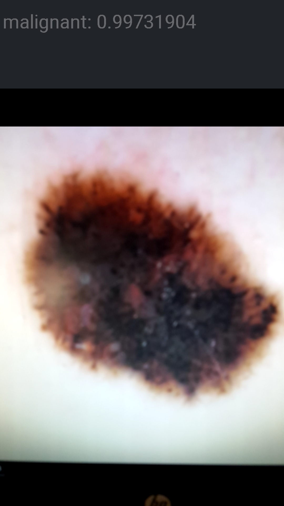

# Skin Deep
*Android App to determine malignancy of skin lesions with 88.5% accuracy*




## Disclaimer

The following software is shared for educational purposes only. The author and its affiliated institution are not responsible in any manner whatsoever for any damages, including any direct, indirect, special, incidental, or consequential damages of any character arising as a result of the use or inability to use this software.
The project Skin Deep is a research project demonstrating an application of deep neural networks to classify  skin lesions based on visual inputs.
The current implementation is not, in any way, intended, nor able to be used as a diagnostic tool in a real-world context.
We could not emphasize enough that this project is experimental and shared for educational purposes only.
Both the source code and the datasets are provided to foster future research in machine intelligence and are not designed for end users.

## Inspiration

* [Stanford Artificial Intelligence Laboratory Skin Lesion Classification](https://www.nature.com/nature/journal/v542/n7639/full/nature21056.html) 
* [Dan Jarvis article about tensorflow on Android](https://medium.com/@daj/creating-an-image-classifier-on-android-using-tensorflow-part-3-215d61cb5fcd)
* [Tensorflow for Poets 2](https://codelabs.developers.google.com/codelabs/tensorflow-for-poets-2/)
* [ISIC archive](https://isic-archive.com)


## Dependencies

* [Python](www.python.org)
* [Docker](www.docker.com)
* [Android Studio](https://developer.android.com/studio/index.html)

## How to build it

If you just want to try the app, download the apk from www.mikely.net/SkinDeep.apk.

If you want to build it on your own, these are the steps needed:

* Dowload the repository and copy tf_files to your home directory

* Download image dataset from:
  <https://isic-archive.com/api/v1/image/download> It is a 40GB dataset so be patient.

* Unzip the dataset to tf_files 

* run:
```
$ cd tf_files
$ python download_name_id.py
```
to download name/id pairs for images. if you don't want to wait just rename
_images_id_name.csv to images_id_name.csv

* from tf_files run:
```
$ python download_metadata.py
```
to download metadata for images. If you don't want to wait just rename 
_images_data.csv to images_data.csv

* from tf_files run:
```
$ python prepare_class_folders.py
```
to resize images and copy them to class folders.

* from tf_files run:
```
$ python prepare.py 
```
to augment images datasets for bening and malignant skin lesions.

* Pull the docker image with tensorflow installed:
We will use the docker image provided by Dan Jarvis, and
explained in his Medium article stated above as inspiration.
This would probably work with the docker image provided
by Google CodeLabs in the Tensorflow for Poets article also
stated above as inspiration. 
```
$ docker pull danjarvis/tensorflow-android:1.0.0
```
You might need to use sudo before docker command.

* run: 
```
$ docker run -it -v $HOME/tf_files:/tf_files danjarvis/tensorflow-android:1.0.0
```
to run the docker image and connect it to $HOME/tf_files folder that contains images. 

* from docker image terminal run:
```
$ cd /tensorflow
$ python tensorflow/examples/image_retraining/retrain.py \
  --bottleneck_dir=/tf_files/bottlenecks \
  --how_many_training_steps 100000 \
  --model_dir=/tf_files/inception \
  --summaries_dir=/tf_files/training_summaries/basic \
  --output_graph=/tf_files/retrained_graph.pb \
  --output_labels=/tf_files/retrained_labels.txt \
  --image_dir /tf_files/augmented
```
to retrain Inception3 model on bening and malignant images.
This might take a very long time since script needs to create bottlenecks for each
image file and then do the training for 100000 steps.
You can get almost as good results with 20000 steps.
Your tf_files folder will now contain retrained_graph.pb and retrained_labels.txt files.

* from docker image terminal run:
```
$ bazel build --local_resources 4096,4.0,1.0 -j 1 tensorflow/python/tools:strip_unused
```
to build the strip_unused tool which will strip some operations from our tensorflow model
so we can use it on mobile device.

* from docker image terminal run:
```
$ bazel-bin/tensorflow/python/tools/strip_unused \
  --input_graph=/tf_files/retrained_graph.pb \
  --output_graph=/tf_files/stripped_retrained_graph.pb \
  --input_node_names="Mul" \
  --output_node_names="final_result" \
  --input_binary=true
```
to strip the tensorflow model.
You will get the stripped_retrained_graph.pb file in your tf_files folder.

* copy model files stripped_retrained_graph.pb and retrained_labels.txt to tf_files/SkinDeepApp/assets

* open SkinDeepApp folder in Android Studio, connect your android device,
run the app and choose your device from the Select Deployment Target dialog.

* alow the app to use camera and storage and you should have SkinDeep app running on your phone. 

